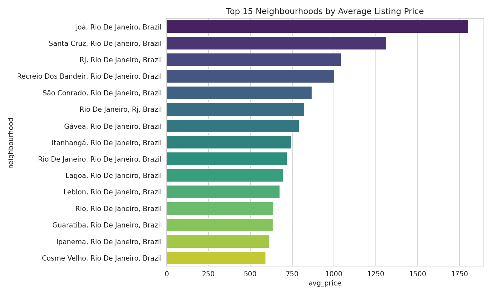
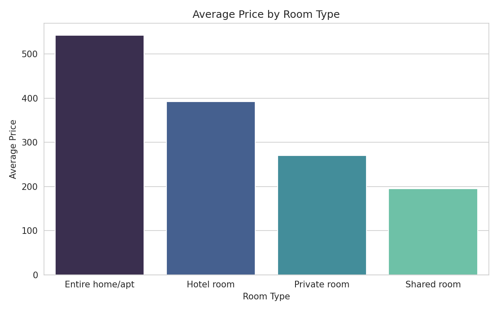
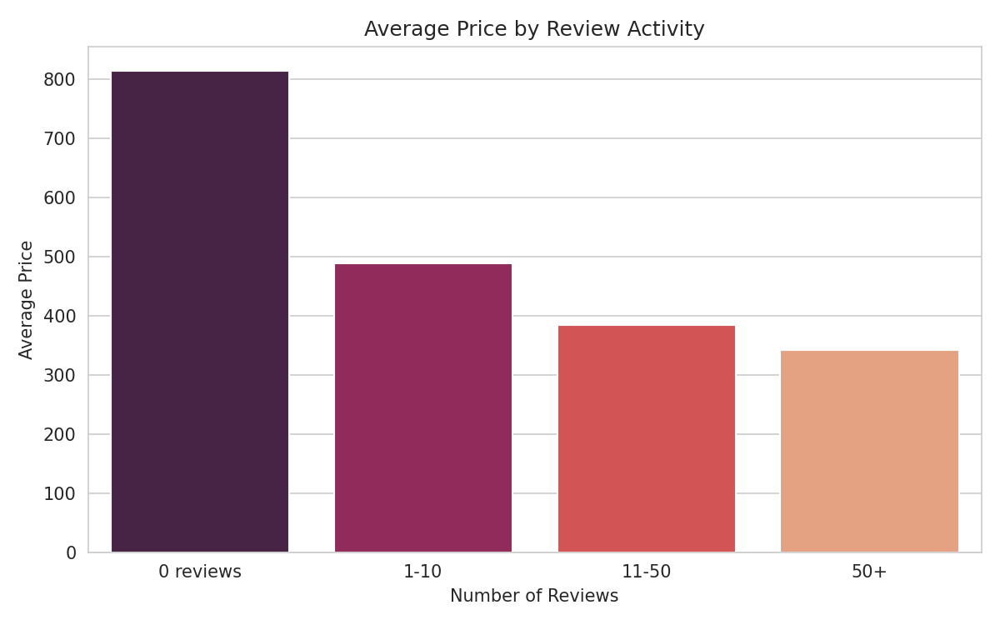

# Airbnb Rio de Janeiro — Pricing & Market Analysis

A SQL + Python data analysis project exploring pricing patterns, room types,
and host behavior across Airbnb listings in Rio de Janeiro, Brazil.

## Overview
This project analyzes real Airbnb listing data to answer questions a business
or travel platform would care about: which areas command the highest prices,
how room type affects pricing, whether new or established hosts price
differently, and whether the market is dominated by individual hosts or
larger property management operations.

## Tools Used
- **SQL (SQLite)** — aggregation, filtering, and grouping queries
- **Python (pandas)** — data cleaning, outlier handling, and analysis
- **Matplotlib / Seaborn** — data visualization
- **Google Colab** — development environment

## Key Findings

- **Entire homes cost significantly more than shared spaces.** Entire
  home/apt listings average $542/night, more than double a private room
  ($270) and nearly 3x a shared room ($195). Entire homes also dominate
  the market, making up 13,105 of the ~16,600 listings analyzed.

- **New listings are priced higher, not lower.** Counterintuitively,
  listings with zero reviews average $814/night — the highest of any
  group — while price steadily drops as review count increases, down to
  $342 for listings with 50+ reviews. This suggests either overconfident
  initial pricing from new hosts, or that higher-end/luxury properties
  haven't yet accumulated reviews, while established listings compete
  more aggressively on price.

- **A handful of hosts operate at commercial scale.** The top host
  manages 159 listings, and names like "Yes Temporada," "RioHost," and
  "Anfitriao Gente Boa" indicate property management companies rather
  than individual hosts — a sign the market includes both casual hosts
  and organized rental businesses.

- **Data quality issues were identified and handled.** ~15,000 listings
  had missing neighbourhood data and were removed. Extreme price outliers
  (one listing was priced at $562,031/night) were capped at the 99th
  percentile. Some neighbourhood names remain slightly fragmented due to
  inconsistent formatting in the source data (e.g. "Rio De Janeiro, Rj"
  vs "Rio De Janeiro, Rio De Janeiro") — a known limitation rather than
  a full fix.

## Charts

**Top 15 neighbourhoods by average price**

**Average price by room type**

**Average price by review activity**

## Skills Demonstrated
- SQL: aggregation, `GROUP BY`, `HAVING`, `CASE` statements
- Python: pandas for data cleaning and outlier handling
- Data visualization: matplotlib/seaborn
- Data quality: missing value handling, outlier detection, text normalization

## How to Run
1. Download `listings.csv` from https://www.kaggle.com/datasets/rafaelaaltermann/listings-csv or see the CSV file for details
2. Open `airbnb_analysis.ipynb` in [Google Colab](https://colab.research.google.com)
3. Run the upload cell and select your `listings.csv` when prompted
4. Run all remaining cells in order (**Runtime → Run all**)
5. Charts are saved as PNGs and can be downloaded directly from Colab

## Data Source
https://www.kaggle.com/datasets/rafaelaaltermann/listings-csv — free, public Airbnb
listings data.

## License
This project is licensed under the MIT License — see the [LICENSE](LICENSE)
file for details.
